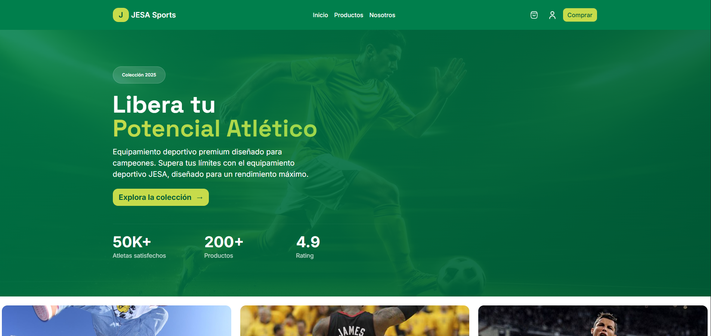

# 🏅 JESA Sports - Equipamiento Deportivo Premium

¡Bienvenido a **JESA Sports**! Una plataforma moderna diseñada para atletas que buscan superar sus límites. Este proyecto combina un diseño responsivo elegante con funcionalidades de administración seguras.

---

## 🚀 Tecnologías Utilizadas


---

## 👥 Equipo de Desarrollo

Nuestros desarrolladores han trabajado arduamente para crear una experiencia de usuario única:

| Foto | Nombre | Rol | Redes |
| :---: | :--- | :--- | :--- |
|  | **Sandra Borboa** | Frontend Developer | [](https://www.linkedin.com/in/sandra-borboa/) [](https://github.com/sandraborboa) |
|  | **Antonio Amaro** | UI/UX Designer | [](#) [](#) |
|  | **Jonathan Caixba** | Backend Developer | [](https://www.linkedin.com/in/jonathan-caixba) [](https://github.com/JonathanCaixba) |
|  | **Erik Pérez** | Backend Developer | [](https://www.linkedin.com/in/erik-perez-d/) [](#) |
|  | **Jorge Arturo** | Backend Developer | [](#) [](#) |

---

## ✨ Características Principales

* **Diseño Responsivo:** Optimizado para móviles, tablets y escritorio con Tailwind CSS.
* **Animaciones Premium:** Transiciones suaves y efectos de entrada escalonados.
* **Panel de Administración:** Acceso restringido mediante llave maestra gestionada con SweetAlert2.
* **Catálogo Dinámico:** Visualización profesional de productos deportivos.

## 🛠️ Instalación y Uso

1.  Clona este repositorio:
    ```bash
    git clone [https://github.com/Antonio-Amaro/JESA-Sports.git)
    ```
2.  Abre el archivo `index.html` en tu navegador favorito.
3.  **Acceso Admin:** Para ingresar a `adminProductos.html`, haz clic en el icono de usuario e ingresa la llave: `Jesa2026`.

---

## 📸 Vista Previa

